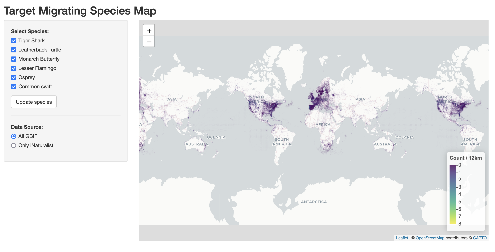

This shiny app uses duckdb and a geoparquet file of all GBIF occurrences for a selection of migratory species to show gaps and opportunities for data collection via the City Nature Challenge.

First project of ours tu use duckdb and geoparquet for data source in shiny app.

 

  <a href="https://calacademy-community-science.shinyapps.io/CNC-Migrating-Species/">Access the shiny app here</a>

